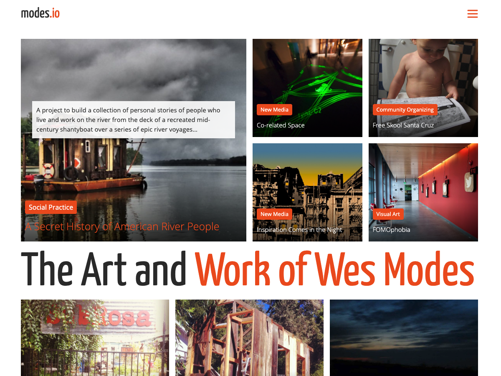

# modes-io-wordpress-theme
Wordpress theme (a child of understrap) for modes.io

A re-design of the modes.io site (originally designed in 2013) from the groundup using a blank-slate theme and a flat information design.

## Design Goals

Here are the design goals for the modes-io-understap theme.

### Organization

Here are some suggested guidelines:

1. No hierarchical organization
1. Many ways to navigate site
1. Everything is organized as flat posts of same category (without date organization)
1. Very few if any "pages"
1. Everything is well tagged and categorized
1. Each post may belong to multiplee categories
1. Selected categories (sculpture, social practice, community organizing, digital art) are featured in menus
1. Menus link to category index pages

### Post Presentation

1. Focus on images and video
1. Minimal text
1. Link captions and photos credits to photos and video
1. Some posts are presented without standard headers, footers, and asides, i.e., full page - but still need some way to navigate (like navburger or escape link)

### Image Presentation

1. Captions in the media library are mandatory, but possibly overridden by captions on the page.
1. Images can be the width of the column, floated right, floated left, extra wide, or the width of the viewport. 
1. Floated left or right images are max 500 wide and offset to the left or right -150px
1. Galleries feature stacked images and are extra wide by 150px on either side
1. Breakpoint when screen narrows at about 1000px stacks everything vertical

### Image Treatment

1. All posts have a feature photo
1. Images are high contrast and saturated, with deep blacks
1. All images are large enough to be used in any layout up to 1000px wide
1. Generally they are in landscape orientation
1. As much as possible, feature photos have people or action
1. If given the choice, warm colors are better

###  Index and Archive Pages

1. Index pages are well presented in a magazine format
1. Posts with "importance" tags (0-100) are more prominently placed in the visual hierarchy 
1. Posts are sorted (in PHP/MySQL) by a weight that is the product of the posts importance and its primary categories importance
1. Weight product is updated when page is edited or created
1. Flexbox and grid are used to make page responsive.
1. Category pages have category name and description under top group

### Front Page Design

1. Frontpage is divided into vertical sections that are approximately a half screen width high (desktop) and full width.
1. Top section is arranged in a visual hierarchy in a variety of tight grid formats favoring the left
1. Post photos have text near bottom, white san serif link text (turning link color on hover)
1. Title text has a black gradient overlay to ensure readability
1. Description drops down from above when hover over image for a post.
1. Description has a white band, and black text over
1. Button in link color above or below text specifies primary category and links to category page

### Navigation

1. Encourage "wandering" route through the site
1. Minimal navigation, maybe only a navburger with a mega menu
1. Related posts with a good related posts plugin
